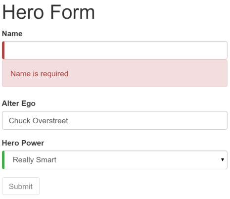

# Angular
## Forms
<br>
<small>by Peter Cosemans</small>

<small>
Copyright (c) 2017 Euricom nv.
</small>

<style type="text/css">
.reveal pre code {
    display: block;
    padding: 5px;
    overflow: auto;
    max-height: 800px;
    word-wrap: normal;
}
</style>

---

# Two forms types

Angular offers two form-building technologies:

* ***Template-driven forms*** <br>
    * Using the ngModel directive with two-way data binding
    * Good for simple forms

* ***Reactive forms*** <br>
    * Define your validation in code
    * One way binding (better with redux)
    * Possible to unit test validation

---

# Template Driven Forms

> Forms driven by the templates

----

## Install

Install forms module

```bash
yarn add @angular/forms
```

Add to module

```ts
import { NgModule }      from '@angular/core'
import { BrowserModule } from '@angular/platform-browser'
import { FormsModule }   from '@angular/forms'
import { AppComponent }  from './app.component'

@NgModule({
  imports: [
    BrowserModule,
    FormsModule
  ],
  declarations: [
    AppComponent,
  ],
  bootstrap: [ AppComponent ]
})
export class AppModule { }
```

----

## Template

Bootstrap styled form

```
<form (ngSubmit)="onSubmit()" #theForm="ngForm" novalidate>
    <div class="form-group">
        <label for="name">Name</label>
        <input type="text" class="form-control" name="name"
               [(ngModel)]="model.name">
    </div>
    <div class="form-group">
        <label for="power">Type</label>
        <select class="form-control" name="type"
                [(ngModel)]="model.type">
            <option *ngFor="let type of types" [value]="type">{{type}}</option>
        </select>
    </div>
    <button type="submit" class="btn btn-success">Submit</button>
</form>
```

The component

```js
export class MyComponent {
    model: any = {}
    types: any = [
        'standard',
        'advanced',
    ]
    submitted = false
    onSubmit() {
        console.log('submit', this.model)
        this.submitted = true
    }
}
```

----

## Validations

```html
<form (ngSubmit)="onSubmit()" #theForm="ngForm">
    <label for="name">Name</label>
    <input type="text" class="form-control" name="name"
           required minlength="4" maxlength="24"
           [(ngModel)]="model.name"
           #name="ngModel">
    <br>Input info: {{name.className}}
    <button type="submit" class="btn btn-success"
            [disabled]="!theForm.form.valid">Submit</button>
</form>
```

Applied class names

- ng-touched or ng-untouched
- ng-valid or ng-invalid
- ng-pristine or ng-dirty

Add classes

```js
styles: [`
    .ng-valid[required]  {
      border-left: 5px solid #42A948; /* green */
    }
    .ng-invalid:not(form)  {
      border-left: 5px solid #a94442; /* red */
    }
`]
```

----

## Validation Error Messages

```html
<label for="name">Name</label>

<input type="text" id="name" class="form-control"
       required minlength="4" maxlength="24"
       name="name" [(ngModel)]="model.name"
       #name="ngModel" >

<div *ngIf="name.errors && (name.dirty || name.touched)"
     class="alert alert-danger">
    <div [hidden]="!name.errors.required">
      Name is required
    </div>
    <div [hidden]="!name.errors.minlength">
      Name must be at least 4 characters long.
    </div>
    <div [hidden]="!name.errors.maxlength">
      Name cannot be more than 24 characters long.
    </div>
</div>
```

---

# Reactive Forms

> Forms driven by the javascript code

----

## Install

Install forms module

```bash
yarn add @angular/forms
```

Add to module

```ts
import { NgModule } from '@angular/core'
import { BrowserModule } from '@angular/platform-browser'
import { ReactiveFormsModule } from '@angular/forms'
import { AppComponent } from './app.component'

@NgModule({
  imports: [
    BrowserModule,
    ReactiveFormsModule
  ],
  declarations: [
    AppComponent,
  ],
  bootstrap: [ AppComponent ]
})
export class AppModule { }
```

> Use the ReactiveFormModule

----

## Template

```html
<form [formGroup]="theForm" (ngSubmit)="onSubmit()">

    <label for="firstName">FirstName</label>
    <input type="text" id="firstName" class="form-control"
           formControlName="firstName" >

    <label for="lastName">LastName</label>
    <input type="text" id="lastName" class="form-control"
           formControlName="lastName" >
    <div *ngIf="formErrors.lastName" class="alert alert-danger">
        {{ formErrors.lastName }}
    </div>

    <button type="submit" class="btn btn-primary"
        [disabled]="!theForm.valid">Submit</button>
</form>
```

Changes:

- The validation attributes are gone
- The formControlName replaces the name attribute
- The two-way [(ngModel)] binding is gone
- The validation messages can be reduced to one div

> The component class is now responsible for defining and managing the form control model.

----

## Component

```js
import { FormGroup, FormBuilder, Validators } from '@angular/forms'

export class MyComponent {
    theForm: FormGroup
    model: any
    constructor(private fb: FormBuilder) { }

    ngOnInit() {
        this.theForm = this.fb.group({
            'firstName': [this.model.firstName],
            'lastName': [this.modell.lastName],   // no validation for now
        })
    }

    onSubmit() {
        this.submitted = true
        this.model = this.theForm.value
    }
}
```

----

## Validations

Template

```html
<div class="form-group"
    [ngClass]="{'has-error':!theForm.controls['lastName'].valid}">
    <label for="name">LastName</label>
    <input type="text" id="lastName" class="form-control"
           formControlName="lastName" >
    <div *ngIf="theForm.controls['firstName'].hasError('required') &&
                theForm.controls['firstName'].touched"
        class="alert alert-danger">
        You must include a first name.
    </div>
    <div *ngIf="theForm.controls['lastName'].hasError('minlength') &&
                theForm.controls['lastName'].touched"
        class="alert alert-danger">
        Your last name must be at least 5 characters long.
    </div
</div>
<button type="submit" class="btn btn-primary"
    [disabled]="!theForm.valid">Submit</button>
```

Component

```js
ngOnInit() {
    this.theForm = this.fb.group({
        'firstName': [this.model.firstName],
        'lastName': [this.model.lastName, [
            Validators.required,
            Validators.minLength(4),
            Validators.maxLength(24),
        ]],
    })
}
```

----

## Handle all in code

```ts
export class MyComponent implements OnInit
  formErrors = {
    'firstName': '',
  }

  validationMessages = {
    'name': {
        'required':  'Name is required.',
        'minlength': 'Name must be at least 4 characters long.',
        'maxlength': 'Name cannot be more than 24 characters long.',
    },
  }

ngOnInit() {
    this.theForm = this.fb.group({
        'firstName': [this.model.firstName],
        'lastName': [this.modell.lastName, [
            Validators.required,
            Validators.minLength(4),
            Validators.maxLength(24),
        ]],
    })

    this.theForm.valueChanges.subscribe(data => this.onValueChanged(data))
    this.onValueChanged() // (re)set validation messages now
}

onValueChanged(data?: any) {
    if (!this.theForm) { return }
    for (const field in this.formErrors) {
        // clear previous error message (if any)
        this.formErrors[field] = ''
        const control = this.theForm.get(field)
        if (control && control.dirty && !control.valid) {
            const messages = this.validationMessages[field]
            for (const key in control.errors) {
                this.formErrors[field] += messages[key] + ' '
            }
        }
    }
  }
}
```

----

## Handle all in code - template

```html
<label for="name">LastName</label>
<input type="text" id="lastName" class="form-control"
       formControlName="lastName" >
<div *ngIf="formErrors.lastName" class="alert alert-danger">
    {{ formErrors.lastName }}
</div>
<button type="submit" class="btn btn-primary"
    [disabled]="!theForm.valid">Submit</button>
```

> See also: [https://ng2.angular-formly.com/](https://ng2.angular-formly.com/)

----
